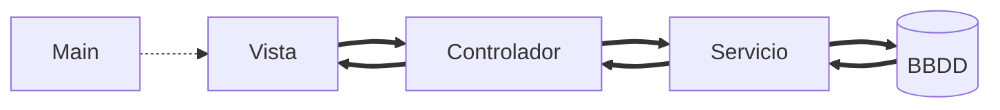
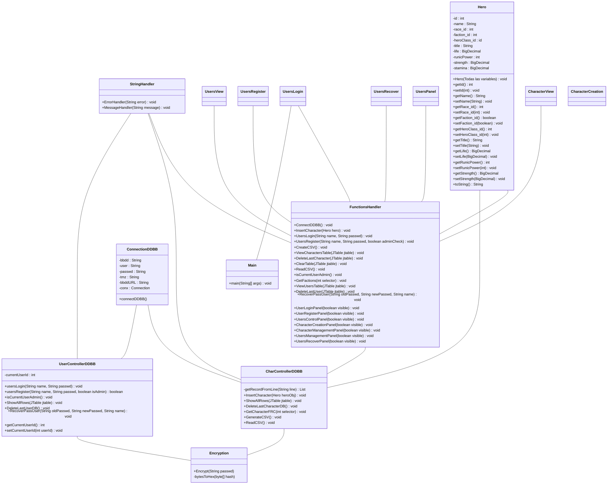

# Modelo-Vista-Controlador Personajes WoW
## MVC basado en las estadísticas de los personajes de World Of Warcraft
Trabajo del tercer trimestre de 1º DAW

# Introducción:
Este proyecto de **MVC (Modelo Vista Controlador)** es un simple gestor de personajes/usuarios del famoso **MMORPG World Of Warcraft**, el cual contiene todas las funciones **CRUD (Create, Read, Update, Delete)**, divididas en diferentes clases y vistas gráficas las cuales el usuario puede usar de forma interactiva.

Se usa la librería de ventanas gráficas **Java Swing** y está basado en la versión de **Java 21**.

# Diagrama de clases:

# Paquetes del proyecto:
El proyecto está dividido en **3 paquetes principales:**
1. Controlador
2. Servicio (Modelo)
3. Vista

## 1.- Controlador:
El paquete de controlador contiene una clase llamada *FunctionsHandler.java*, la cual se utiliza como un puente entre el backend que conecta la base de datos (paquete Servicio) y realiza acciones sobre ella, y la vista de usuario (Paquete Vista), el cual se encarga de registrar las acciones que realiza el usuario sobre la aplicación.

### Clases dentro de Controlador:
#### FunctionsHandler.java
Gestiona la interacción entre la interfaz de usuario y la base de datos para el manejo de usuarios y personajes. Incluye funcionalidades para conectar a la base de datos, insertar y eliminar registros, mostrar y actualizar tablas en la interfaz gráfica, y manejar transiciones entre diferentes vistas de la aplicación.

## 2.- Servicio
Es responsable de gestionar la estructura de datos, interactuar con la base de datos para realizar consultas, actualizaciones y otras operaciones de datos.

### Clases dentro de Servicio:
#### CharControllerDDBB.java
Realiza operaciones relacionadas con la gestión de la tabla de heroes dentro de la base de datos. Incluye métodos para insertar, mostrar, eliminar y gestionar registros de héroes en la base de datos. También tiene funciones para generar y leer archivos CSV relacionados con estos datos. Está diseñado para interactuar con otros componentes de la aplicación para realizar estas tareas de gestión de datos.

#### ConnectionDDBB.java
Proporciona un método estático connectDDBB que inicializa y retorna una conexión a la base de datos configurada, preparando el entorno para que otros componentes del modelo interactúen con la base de datos.

#### Encryption.java
Utiliza el algoritmo SHA-256 para convertir texto claro en una forma encriptada y segura. El método Encrypt recibe una contraseña, la encripta usando SHA-256, y luego convierte el resultado en una cadena hexadecimal que se devuelve como resultado final. Este proceso asegura que las contraseñas manejadas en la aplicación sean almacenadas de forma segura y no en texto plano.

#### Hero.java
Hero.java es un bean de Java que se caracteriza por varios atributos como id, name, race_id, faction_id, heroClass_id, title, life, runicPower, strength, y stamina. El modelo proporciona métodos para obtener y establecer cada uno de estos atributos, lo que permite manipular los datos del héroe dentro de la aplicación. Además, incluye un constructor para inicializar un héroe con valores específicos y un método toString() para representar el objeto en forma de cadena de texto.

#### UserControllerDDBB.java
Realiza operaciones relacionadas con la gestión de la tabla de usuarios dentro de la base de datos. Incluye métodos para el inicio de sesión de usuarios, registro de nuevos usuarios, recuperación de contraseñas, y manejo de usuarios en la interfaz de administración. También proporciona funciones para mostrar y eliminar usuarios en una tabla de la interfaz de usuario.

## 3.- Vista
Se encarga de la presentación de la interfaz de usuario. Contiene todas las clases y componentes gráficos necesarios para interactuar con el usuario, como ventanas, botones, campos de texto y tablas. Su función principal es mostrar información al usuario de manera clara y permitir la interacción con el sistema. Este paquete se comunica con el Controlador para manejar las acciones del usuario y actualiza su contenido según los cambios en los datos del Servicio.

### Clases dentro de Vista:
#### CharacterCreation.java
Proporciona una interfaz gráfica para que los usuarios ingresen los detalles de un nuevo personaje, como nombre, raza, facción, clase, atributos del propio héroe (vida, poder rúnico, fuerza, estamina) y título. Los usuarios pueden seleccionar las opciones disponibles en los menús desplegables y completar los campos de texto correspondientes.

#### CharacterView.java
Proporciona una tabla que muestra los detalles de los personajes, como nombre, raza, facción, clase, título, vida, poder rúnico, fuerza y estamina. Los usuarios pueden ver los personajes disponibles haciendo clic en el botón "Ver Personajes", borrar el último personaje creado con el botón "Borrar Último Personaje", generar un archivo CSV con los datos de los personajes con el botón "Generar CSV" e introducir datos desde un archivo CSV con el botón "Introducir CSV".

#### StringHandler.java
Proporciona dos funciones principales: ErrorHandler para detectar y manejar errores específicos, como la entrada duplicada de un nombre de personaje, y MessageHandler para mostrar mensajes de confirmación dependiendo del código proporcionado.
Estos mensajes son más amigables para el usuario y proporcionan información sobre acciones exitosas o errores ocurridos durante el proceso de interacción con la aplicación.

#### UsersLogin.java
Proporciona una interfaz gráfica para que los usuarios ingresen sus credenciales y puedan iniciar sesión en la aplicación. Además, ofrece opciones para recuperar contraseña y registrarse como nuevo usuario.

#### UsersPanel.java
Proporciona botones para acceder a diferentes funciones, como la creación de personajes, la administración de personajes y, si el usuario actual es un administrador, la administración de usuarios. Los botones están vinculados a acciones en el controlador a través de FunctionsHandler.

#### UsersRecover.java
Proporciona campos para ingresar el nombre de usuario, la antigua contraseña y la nueva contraseña. Cuando el usuario presiona el botón "Cambiar contraseña", se invoca una función en el controlador (FunctionsHandler) para llevar a cabo el proceso de recuperación de contraseña.

#### UsersRegister.java
Proporciona campos para ingresar un nombre de usuario y una contraseña, con la opción adicional de marcar la casilla "Administrador" si se desea otorgar privilegios de administrador al nuevo usuario. Cuando el usuario presiona el botón "Registrar", se invoca una función en el controlador (FunctionsHandler) para llevar a cabo el proceso de registro del nuevo usuario.

#### UsersView.java
Muestra una tabla con los datos de los usuarios, como su ID, nombre, contraseña y si son administradores o no. El usuario puede ver esta información y realizar acciones como eliminar el último usuario registrado.

## 4.- Main
### Main.java
Inicia la aplicación creando una instancia de FunctionsHandler y llamando al método UserLoginPanel(true) para renderizar la ventana de inicio de sesión de usuarios. Esto se realiza dentro de un bloque EventQueue.invokeLater para garantizar que la interfaz de usuario se cree y se muestre en el hilo de despacho de eventos de Swing.

# Base de Datos
La base de datos se llama gestwow y está formada por las siguientes tablas:

## Tablas de la base de datos:
1. Tabla user: Guarda detalles sobre los usuarios del sistema, como su nombre, contraseña (hashed), si son administradores o no.
2. Tabla hero: Esta tabla guarda información detallada sobre los personajes del juego, como su nombre, raza, clase, facción, estadísticas, etc.
3. Tabla faction: Esta tabla almacena información sobre las facciones del juego (por ejemplo, Alianza y Horda).
4. Tabla heroclass: Almacena información sobre las clases disponibles en el juego (por ejemplo, Guerrero, Paladín, Cazador, etc.).
5. Tabla race: Contiene información sobre las razas disponibles en el juego (por ejemplo, Humano, Enano, Elfo de la Noche, etc.).-

## Uso de la base de datos:
Para poder comenzar a usar la aplicación, deberemos crear una base de datos dentro de MySQL llamada `gestwow` y luego importar el archivo `gestwow.sql`, el cual se encuentra dentro de la carpeta `bdsql`.
Podemos realizar la importación fácilmente con el siguiente comando: `mysql -u root gestwow < gestwow.sql`.

# Usuarios de la base de datos
## Alejandro - Administrador
- Usuario: alejandro
- Contraseña: 123

## Luis - Usuario normal
- Usuario: luis
- Contraseña: 1212

